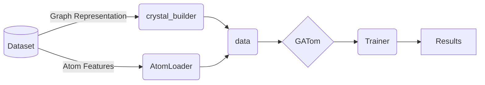

# GATom

**GATom**: a Graph + Gated Attention-based neural neTwork for material property prediction.

This repository host a Graph Neural Network Model to predict the properties of materials for their crystalline structure.
The structures is converted into a graph (which retains all the symmetries) and then it is feeded into the network to infer the desired property, e.g., the value of the gap.

## Preprocessing

This folder contains the `AtomLoader.py`file which generates the atom features vector representations.
It also contains a `main.py` file to generate those representations.

## Data Construction

The `crystal_builder` folder contains the files need to convert the crystal structure into a graph using a variety of algorithms.
It is a fork from the [`kgcnn`](https://github.com/aimat-lab/gcnn_keras/tree/master/kgcnn/crystal) library adapted to work with `Pytorch` objects. All the credits should be given to the authors of that library.

The `Pytorch-Geometric` dataset is built using `data.py` file where atom and edge features are incorporated into the graph.

## Models 

GATom is a graph neural network architecture that combines local and global graph attention with gating (using GLU) and optional residual connections for node and edge feature processing. 

**Note**: The model is still under development and we are currently writing a paper about the model to explain it with more detail.

We have also included a custom implementation of in `cgcnn.py` and an "improved" version (`IMcgcnn.py`) in which the edge features are also convoluted. However, we found that the edge convolution did not increase the accuracy of the model.

## Training & Evaluation

The training plus the evaluation is done through the `Trainer` class inside `training.py`

## Parameters

In this folder, we display a sample `.yml` file for each of the available models.
Furthermore, we include the best set of hyperparameters (found using bayesian optimization) for each dataset.

## Performance

Currently, the best achieved performance for each of the datasets is

|           Dataset           	| _mp_gap_ (MAE eV) 	| _perovskites_ (MAE eV/unit cell) 	| _mp_is_metal_ (ROCAUC) 	|
|:---------------------------:	|:-----------------:	|:--------------------------------:	|:----------------------:	|
| Without Residual Connection 	| 0.21040           	| 0.05404                          	| 0.95024                	|
| With Residual Connection    	| 0.23214           	| 0.04486                          	| 0.95738                	|

## How to use

We provide a sample `.sbatch` script on how to run the model. 
It only needs a `.yml` configuration file on the same folder.
Right now, the `main.py` accepts two possible types of calculations which are given as arguments in the parser.

- `--single_calc`: Performs a full training (alongside obtaining evaluation and testing errors) routine for the given dataset.
- `--hyperparam_optim`: Performs a hyperparameter optimization using the Ray Tune library for the given dataset.

## Diagram

We provide a flow diagram of how to proceed for a given dataset:

